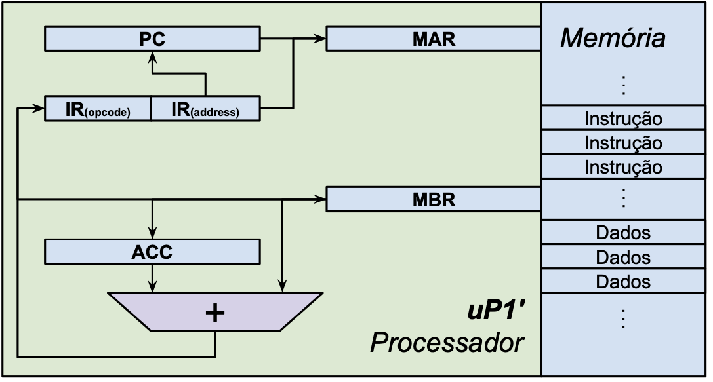
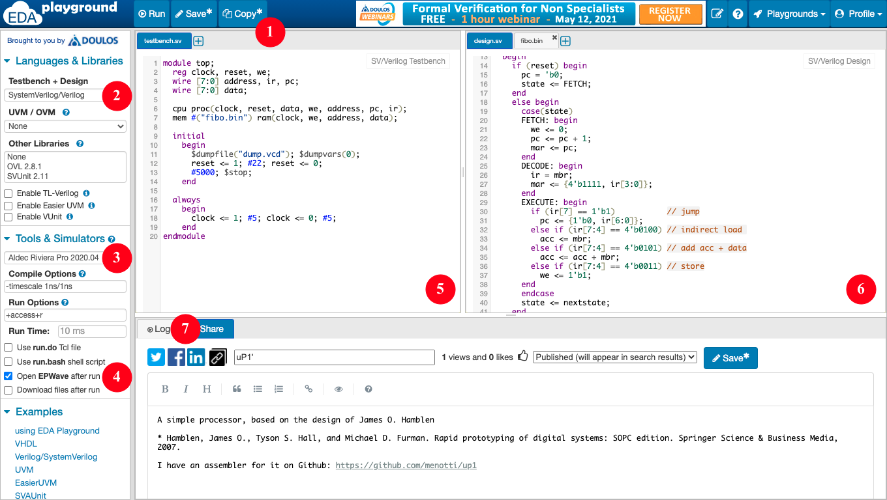

# Microprocessadores e Microcontroladores (27146)

# Trabalho Nº 1

## Simulando e modificando o processador uP1' e seu montador

## 1. Instruções Gerais

- Grupos definidos no AVA;
- Ler o documento sobre Normas para entrega dos Relatórios;
	- Opcionalmente, o relatório pode ser escrito no `README.md`;
- Ler atentamente todo o enunciado deste trabalho antes de realizá-lo;
- Verificar as folhas de dados (*datasheets*) e manuais sempre que necessário;
- A entrega será no repositório gerado para o grupo no Classroom 50.

## 2. Objetivos da Prática

- Conhecer o processador uP1' e seu conjunto de instruções;
- Familiarizar-se com a programação *assembly* para resolver problemas simples;
- Realizar mudanças simples no processador e em seu montador;
- Descrever as atividades gerais desenvolvidas em laboratório.

## 3. Materiais e Equipamentos

- Processador [uP1'](https://github.com/menotti/up1/);
- Simulador [EDA Playground](https://www.edaplayground.com/x/sNSX) ou [GitHub Codespaces](https://codespaces.new/menotti/up1/);
- Sistema de controle de versão [Git](https://git-scm.com/).

## 4. Fundamentos teóricos

As orientações a seguir são genéricas, o repositório do trabalho é gerado automaticamente pelo Classroom e cada um deve clonar o do seu grupo. Se você optar por usar o Codespaces, ele já clona automaticamente o repositório para você.

### 4.1. Sistema de controle de versão Git

Sistemas de controle de versão como o Git são importantes para manter o histórico de evolução dos projetos, facilitar a experimentação e o trabalho em equipe. Nesta disciplina, vamos adotar o Git por ser o sistema mais difundido atualmente. A seguir, são listados alguns comandos que podem ser úteis na execução do trabalho, visando facilitar sua realização. O símbolo `~` representa seu diretório padrão e o `$` o prompt de comandos do sistema operacional. Não serão listados comandos para mudança de diretórios, mas o atual estará indicado no prompt. Para se obter uma cópia local do processador, clone seu repositório usando o comando:

```console
~$ git clone https://github.com/menotti/up1
Cloning into 'up1'...
remote: Enumerating objects: 84, done.
remote: Counting objects: 100% (84/84), done.
remote: Compressing objects: 100% (54/54), done.
remote: Total 84 (delta 32), reused 78 (delta 28), pack-reused 0
Unpacking objects: 100% (84/84), done.
```

Acesse o diretório criado e veja que ele está vinculado com a cópia remota:

```console
~/up1$ git remote -v
origin https://github.com/menotti/up1 (fetch)
origin https://github.com/menotti/up1 (push)
```

Não há nenhum problema nisso, mas você não conseguirá colocar suas alterações de volta no meu repositório (não quero os gabaritos lá ;-). Se você preferir criar um repositório remoto para o seu grupo, por favor, faça isso de modo privado para não publicar os resultados dos trabalhos.

Conforme você vai alterando o código, pode verificar quais arquivos foram modificados com o comando:

```console
~/up1$ git status
On branch master
Your branch is up to date with 'origin/master'.
Changes not staged for commit:
(use "git add <file>..." to update what will be committed)
(use "git checkout -- <file>..." to discard changes in working directory)
modified: assembler/tables.py
modified: processor/cpu.sv
no changes added to commit (use "git add" and/or "git commit -a")
```

Há também um comando para ver as modificações, que pode ser aplicado ao repositório todo ou a um ou mais arquivos selecionados na linha de comando. No exemplo a seguir foi adicionada a instrução `SUB` ao nosso processador. Como ela já estava presente no montador, ela foi removida apenas para fins didáticos:

```diff
~/up1$ git diff
diff --git a/assembler/tables.py b/assembler/tables.py
@@ -1,6 +1,5 @@
 inst_table = {
 "ADD" : "0101",
- "SUB" : "0110",
 "LOAD" : "0100",
 "STORE" : "0011",
diff --git a/processor/cpu.sv b/processor/cpu.sv
@@ -33,6 +33,8 @@ module uP(
			acc <= mbr;
		 else if (ir[7:4] == 4'b0101) // add acc + data
			acc <= acc + mbr;
+        else if (ir[7:4] == 4'b0110) // add acc - data
+           acc <= acc - mbr;
		 else if (ir[7:4] == 4'b0011) // store
			we <= 1'b1;
         end
```

**Para a entrega desta atividade, você terá que apresentar as diferenças nos arquivos modificados, ao invés de listar os códigos completos.** Se você tiver dificuldades com o controle de versões, pode baixar um arquivo [.zip do repositório](https://github.com/menotti/up1/archive/refs/heads/master.zip) e usar a ferramenta `diff` ou o [Diffchecker](https://www.diffchecker.com/) para destacar as alterações no relatório.

### 4.2. Processador uP1'


Figura 1: Processador uP1' (8 bits) [^1]

O processador uP1' foi construído para fins didáticos. Portanto, ele tem intencionalmente poucas instruções e alguns espaços vazios tanto no endereçamento de memória quanto nos *opcodes* de instruções. O único registrador de propósito geral é o acumulador (`ACC`), que é usado como destino/origem das instruções `LOAD`/`STORE`, respectivamente. Ele também é usado como operando e destino da instrução `ADD`. Os demais registradores têm propósito específico:

- **PC** (*program counter*): aponta para a próxima instrução a ser executada;
- **MAR** (*memory address register*): usado para endereçar a memória, tanto para dados quanto para instruções;
- **IR** (*instruction register*): armazena a instrução atual;
- **MBR** (*memory buffer register*): usado para enviar/receber dados e instruções da memória.

Na Figura 1 é demonstrado um esquema do processador e sua interface com a memória, que armazena tanto instruções como dados (esquema proposto por Von Neumann [^2]).

Seu conjunto de instruções (ISA, do inglês *Instruction Set Architecture*) inicial possui 4 instruções, todas com 8 bits, em 2 formatos, apresentados a seguir:

#### Formato M

- Endereço: `0x1111_endereço_D`

| Bits 7-4 | Bits 3-0 | Instrução |
|:---:|:---|:---:|
| `0000` | endereço D | não usada |
| `0001` | endereço D | não usada |
| `0010` | endereço D | não usada |
| `0011` | endereço D | `STORE`   |
| `0100` | endereço D | `LOAD`    |
| `0101` | endereço D | `ADD`     |
| `0110` | endereço D | não usada |
| `0111` | endereço D | não usada |

#### Formato J

- Endereço: `0x0_endereço_I`

| Bit 7 | Bits 6-0 | Instrução |
|:---:|:---:|:---|
| `1` | endereço I (+7 bits) | `JUMP` |

Note que a instrução `JUMP` possui um formato diferente, com apenas um bit de *opcode* e os demais para endereço. Por se tratar de um salto absoluto, isso faz com que seja possível saltar para qualquer posição da primeira metade da memória. Já as instruções de acesso à memória possuem 4 bits de endereço, o que nos deixa apenas com 16 palavras para serem endereçadas. A organização de memória resultante é a seguinte:

- **Instruções:** endereços `00000000` a `01111111`, totalizando $2^7 = 128$ palavras;
- **Não usada:** endereços `10000000` a `11101111`, totalizando $2^7 - 2^4 = 112$ palavras;
- **Dados:** endereços `11110000` a `11111111`, totalizando $2^4 = 16$ palavras.

### 4.3. Simulador EDA Playground



Para simular o funcionamento do processador, vamos usar uma interface web que permite interagir com diversos simuladores profissionais e acadêmicos. Na interface do EDA Playground, observe os seguintes detalhes:

1. Botão para fazer uma cópia do projeto, gerando outra URL;
2. Seleção da linguagem usada no projeto;
3. Seleção do simulador usado no projeto;
4. Caixa para abrir o visualizador de diagrama de formas de onda (EPWave);
5. Código do arquivo que gera os estímulos (`clk` e `reset`) para a simulação e instancia o processador e a memória;
6. Código do processador e da memória(na aba ao lado fica o código do programa em binário que será executado no processador);
7. Aba com a janela de Logs, importante para depurar erros.

Após a primeira abertura do EPWave, é preciso clicar em **Get Signals** para incluir os sinais desejados na visualização.

## 5. Procedimentos

Antes de realizar qualquer modificação no código, os participantes do grupo devem discutir as alterações a serem realizadas e esboçar “no papel” as suas estratégias para as colocar em prática. Isso evita que os participantes tenham compreensões diferentes sobre o que precisa ser feito e antecipa problemas que podem surgir durante a implementação das mudanças deliberadas.

O grupo deve evitar, por enquanto, estratégias que impliquem em alterações complexas no processador, por exemplo, adicionar estados, portas, sinais ou registradores. Em geral, as mudanças solicitadas podem ser implementadas com a inclusão ou modificação de poucas linhas de código no ciclo de execução do processador (`EXECUTE`). As alterações do montador também devem ser simples; a maioria delas pode ser feita apenas alterando as tabelas do arquivo `tables.py`.

Para realização deste trabalho, o grupo deverá efetuar obrigatoriamente no mínimo **4 alterações no processador**, que implicam também em alterações no montador e na escrita de programas para sua validação. As alterações não precisam necessariamente ser feitas “em cascata”, pois algumas delas poderiam inviabilizar outras. As duas primeiras alterações serão efetuadas por todos os grupos; as outras podem ser escolhidas livremente a partir do número 3 da lista a seguir:

1. **(obrigatória)** Incluir a instrução de subtração (`SUB`) no processador para que ele seja capaz de executar um programa para gerar a série de Fibonacci de trás para frente, partindo do número 233 (`ribo.asm` em nosso repositório). No repositório há também um programa em Python mostrando seu funcionamento (`fibo.py`). Nosso montador já é capaz de reconhecer e gerar esta instrução, então fique atento ao *opcode* na hora de incluí-la no processador.
2. **(obrigatória)** Implementar um programa para calcular outra série de inteiros, escolhida a partir da [lista de sequências inteiras](https://en.wikipedia.org/wiki/List_of_integer_sequences). Escolha uma série simples que possa ser gerada a partir das instruções existentes (`ADD` e `SUB`), pois algumas delas precisariam de verificações complexas, como números primos.
3. Dobrar o espaço de endereçamento de dados, fazendo com que as instruções tenham 3 bits de *opcode* e 5 de endereço. Note que isso reduz o número total de instruções possíveis.
4. Implementar uma instrução de salto condicional, saltando apenas quando o acumulador é diferente de zero (`JNZ`). Note que isso pode ser feito alterando a instrução (`JUMP`), pois o salto incondicional poderia ser obtido fazendo o `LOAD` de um valor diferente de zero antes.
5. Tornar as instruções de salto relativas, fazendo com que se possa saltar para qualquer posição da memória. Note que é possível reduzir o campo de endereço do salto e que é necessário ao montador verificar se o tamanho do salto é possível de acordo com a distância.
6. Implementar uma instrução de salto condicional, saltando apenas quando o acumulador é igual a zero (`JZ`). Note que isso pode ser feito alterando a instrução (`JUMP`), pois o salto incondicional poderia ser obtido fazendo o `LOAD` de um valor zero antes.
7. Incluir uma ou mais instruções lógicas ao processador (`AND`, `OR`, `NOT`, `XOR`, etc.).
8. Incluir uma ou mais instruções de deslocamento ao processador (`ROR`, `ROL`, `SHR`, `SHL`, `SAR`, etc.).

Após a implementação das modificações, o grupo deve testar exaustivamente a simulação de programas para detectar problemas. Deve também documentar detalhadamente as alterações no código, conforme instruções dadas no final da Seção 4.1, ou seja, comentando apenas as alterações e não listando o código completo. É importante discutir as alterações, justificando as escolhas tomadas e comentando outras possibilidades de implementação com implicações diferentes. Inclua links para uma ou mais cópias do processador modificados com seus respectivos problemas, para que seja possível reproduzir o trabalho. Se possível, faça o mesmo com o montador; há sites que permitem compartilhar projetos de software e executá-los diretamente no navegador.

## Referências Bibliográficas

[^1]: J. O. Hamblen and M. D. Furman, *Rapid Prototyping of Digital Systems*. Kluwer, 2001.
[^2]: D. E. Knuth, “Von Neumann's first computer program,” *ACM Computing Surveys (CSUR)*, vol. 2, no. 4, pp. 247–260, 1970.
