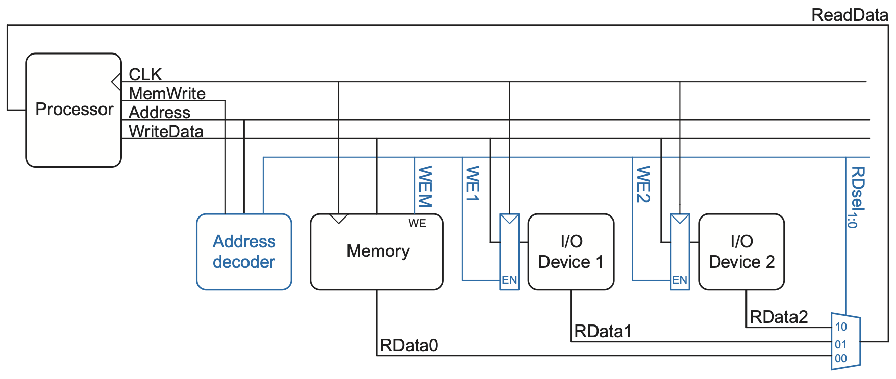
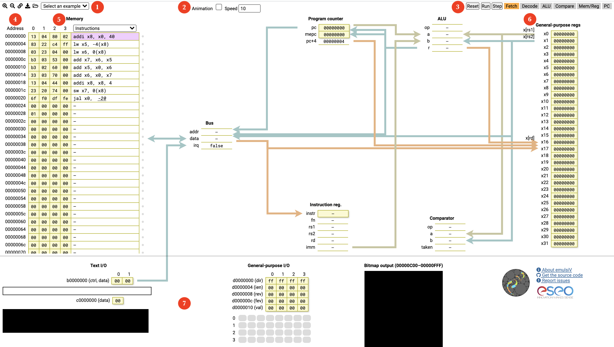

# Trabalho Nº 2

## RISC-V: Entrada e Saída Mapeada em Memória (MMIO)

## 1. Instruções Gerais

- Grupos definidos no AVA;
- Ler o documento sobre Normas para entrega dos Relatórios;
	- Opcionalmente, o relatório pode ser escrito no `README.md`;
- Ler atentamente todo o enunciado deste trabalho antes de realizá-lo;
- Consultar as referências adicionais e manuais sempre que necessário;
- A entrega será no repositório gerado para o grupo no Classroom 50.

## 2. Objetivos da Prática

- Conhecer o processador RISC-V e seu conjunto de instruções;
- Conhecer o mecanismo de mapeamento de entrada e saída em memória;
- Familiarizar-se com a programação *assembly* para resolver problemas simples;
- Realizar mudanças simples no processador (opcional);
- Descrever as atividades gerais desenvolvidas no trabalho em um relatório.

## 3. Materiais e Equipamentos

- GCC e QEMU; e/ou
- Simulador RARS; e/ou
- Simulador online animado;
- Documentação: RISC-V Specifications;
- Processador RISC-V em Verilog (incompleto).

> Consulte a documentação dos simuladores. Nem todas as instruções são suportadas por eles.

## 4. Fundamentos teóricos

### 4.1. Entrada e Saída Mapeada em Memória (MMIO)

Computadores não teriam muita utilidade se não pudessem se comunicar com o mundo real. Dispositivos de entrada e/ou saída, tais como teclado, mouse, sensores, monitores, impressoras e interfaces de rede, tornam esta comunicação possível.

Uma forma bastante comum de implementar a interface com periféricos é por meio de mapeamento no espaço de memória. A técnica consiste em associar um ou mais endereços de memória com cada dispositivo, fazendo acesso com instruções comuns do processador, como se transferisse dados de ou para uma memória.

É possível usar suporte de *hardware* para fazer isso, conforme a Figura 1. Neste exemplo, um decodificador de endereços é usado para: (i) acionar os sinais de escrita nos diversos dispositivos; (ii) selecionar a saída do dispositivo, direcionando-a para o processador.


Figura 1: Suporte de hardware para entrada e saída mapeada em memória [^1]

Suponha que o primeiro dispositivo de entrada/saída (*I/O Device 1*) esteja associado ao endereço de memória `0x20001000`. O código assembly do RISC-V para enviar o valor `7` ao dispositivo poderia ser:

```asm
.text
addi t1, zero, 7       # valor a ser escrito
la s0, dev1            # carrega endereço de memória
lw s1, (s0)            # carrega endereço do dispositivo
sw t1, (s1)            # escreve no dispositivo

.data
dev1:
.word 0x20001000       # endereço do dispositivo na memória
```

O decodificador de endereço aciona `WE1` porque o endereço é `0x20001000` e `MemWrite` é `TRUE`. O valor no barramento `WriteData`, `7`, é escrito no registrador conectado aos pinos de entrada do dispositivo.

Para ler do mesmo dispositivo, o processador poderia executar o seguinte código assembly:

```asm
lw t1, (s1)            # lê do dispositivo apontado por s1, gravando em t1
```

O decodificador de endereço configura `RDsel1:0` para `01`, porque detecta o endereço `0x20001000` e `MemWrite` é `FALSE`. A saída do dispositivo passa pelo multiplexador no barramento `ReadData` e é carregada em `t1` no processador.

### 4.2. Simulador emulsiV

No simulador emulsiV é possível visualizar detalhadamente a execução de uma instrução observando os valores no caminho dos dados (*datapath*) do processador. Suas funcionalidades principais são listadas a seguir, confome numeração na Figura 2:


Figura 2: Simulador emulsiV [^2]

1. **Barra de comandos**, respectivamente:
	- Aumentar fonte;
	- Diminuir fonte;
	- Gerar um link para a simulação corrente;
	- Baixar o programa no formato Intel HEX;
	- Abrir um programa no mesmo formato;
	- Carregar um dos exemplos disponíveis no *dropdown*.
2. **Animação:** ativar a animação e selecionar a velocidade.
3. **Barra de simulação**, respectivamente:
	- **Reset:** reinicia a simulação, mas não restaura a memória;
	- **Run:** dispara a simulação;
	- **Step:** avança um passo na simulação;
	- **Fetch..PC:** indica o estado atual quando a animação está ativada.
4. **Address:** endereço de memória. Não há distinção entre a área de código e a área de dados.
5. **Memory:**
	- Na coluna da esquerda (amarela), o conteúdo da memória é mostrado byte a byte, com o mais significativo à direita;
	- Na coluna da direita é possível visualizar o conteúdo da memória em vários formatos, selecionados no *dropdown*;
	- Em ambas as colunas é possível editar o conteúdo, embora o assembly usado seja limitado. Por exemplo, não é possível usar rótulos; é necessário informar numericamente os endereços de dados e saltos.
6. **Banco de registradores:** exibe os valores e permite alteração.
7. **Dispositivos de Entrada/Saída:**
	- **Text Input/Output:** entrada e saída por texto;
	- **General-Purpose Input/Output (GPIO):** 32 pinos de propósito geral que podem ser configurados, clicando com o botão direito do mouse, como:
	  - Desabilitado (cinza claro);
	  - *Push button* (cinza escuro);
	  - *Switch button* (dividido em cinza claro/escuro);
	  - LED (círculo preto/verde);
	- **Bitmap:** display colorido.

Um exemplo do programa para gerar a série de Fibonacci pode ser carregado no formato Intel HEX. A edição direta do arquivo nesse formato não é recomendada, pois ele possui campos calculados.

### 4.3. Simulador RARS e *syscalls*

O RISC-V Assembler and Runtime Simulator (RARS) [^3] é um montador e simulador de execução para RISC-V. Além das funcionalidades conhecidas dos simuladores usados até agora, ele possui ferramentas externas interessantes, tais como:

- Gerador de estatísticas sobre instruções executadas e acessos à memória, saltos etc.;
- Laboratório Digital com teclas e displays;
- Entrada e saída por texto;
- Display Bitmap;
- Timer.

Algumas destas ferramentas estão disponíveis via Memory Mapped I/O (MMIO), sendo necessário conectá-las ao programa antes de iniciar a execução. Todas elas possuem um botão de ajuda com a descrição de seu funcionamento.

Outras funcionalidades do RARS estão disponíveis por meio de chamadas de sistema (*syscalls*). Elas são mecanismos usados para que um programa possa fazer uso de um recurso gerenciado pelo sistema operacional. De forma bastante resumida, em um sistema computacional, um programa de usuário não pode acessar diretamente certos recursos, como periféricos, então solicita ao sistema operacional que faça isso por ele.

Os processadores podem possuir também:

- Instruções privilegiadas, que só podem ser executadas em modos específicos;
- Mecanismos de exceções (*exceptions*), que são disparadas quando algo incomum acontece.

O programa a seguir usa duas chamadas de sistema:

- Chamada `4`, usada para imprimir uma *string*;
- Chamada `8`, usada para ler uma *string*.

Como o código fica repetitivo, foi criada uma macro para fazer a escrita da segunda *string* em diante. No menu **Help** há instruções detalhadas sobre o funcionamento de *syscalls*, *exceptions* e macros.

```asm
.macro imprime (%string)
la a0, %string
li a7, 4
ecall
.end_macro

.text
# print question
la a0, what
li a7, 4
ecall

# read the name
la a0, name
li a1, 255
li a7, 8
ecall

imprime(hello)
imprime(name)

.data
what: .asciz "What is your name?\n"
hello: .asciz "Hello, "
name: .space 256
```

### 4.4 GCC e QEMU

No material disponível do processador LightRISC [^4] há exemplos de como usar as ferramentas de compilação (GCC), simulação (iverilog) ou emulação (QEMU) para validar os programas desenvolvidos. 

## 5. Procedimentos

Para realização deste trabalho, o grupo deverá implementar obrigatoriamente no mínimo **5 programas em assembly do RISC-V usando mecanismos de entrada e saída**. As duas primeiras implementações serão efetuadas por todos os grupos; as outras podem ser escolhidas livremente a partir do número 3 da lista a seguir:

1. **(obrigatório)** Implementar um programa para inverter uma string informada pelo usuário;
2. **(obrigatório)** Implementar um programa para converter para maiúsculas uma string informada pelo usuário;
3. Implementar um programa para detectar se uma string é palíndroma, ignorando espaços, caracteres especiais e maiúsculas/minúsculas. Por exemplo, a frase a seguir deve ser aceita: “Socorram-me, subi no onibus em Marrocos”;
4. Implementar um programa (opcional, item 3 em diante) de processamento de imagens do [trabalho seguinte (ARM)](Trabalho_3.md);
5. Implementar um jogo simples, como adivinhar um número, jogo da velha ou forca;
6. Pesquisar as *calling conventions* no RISC-V e implementar um programa que faça uso de *stack frame* na pilha;
7. Simular qualquer um desses programas no Processador RISC-V em Verilog (incompleto). Pode ser preciso completar as instruções faltantes.
8. Implementar um contador binário controlado por GPIO: cada acionamento de um *push button* deve incrementar o contador e o estado dos bits deve ser exibido nos LEDs. O programa deve permitir zerar o contador usando outro botão ou *switch*;
9. Implementar uma aplicação gráfica no display Bitmap, como um desenho interativo, labirinto ou jogo de movimentação. A aplicação deve receber comandos por GPIO ou entrada de texto e atualizar apenas as regiões necessárias da tela;
10. Implementar um cronômetro ou jogo de reação utilizando o Timer e algum dispositivo de saída. O programa deve medir o intervalo entre um evento de entrada, como o acionamento de um botão, e a resposta do usuário, exibindo o resultado por texto, GPIO ou Bitmap.

## Referências Bibliográficas

[^1]: [Digital Design and Computer Architecture](https://www.elsevier.com/books/digital-design-and-computer-architecture/harris/978-0-12-800056-4)
[^2]: [Documentação do emulsiV](https://eseo-tech.github.io/emulsiV/doc)
[^3]: [RARS](https://github.com/TheThirdOne/rars)
[^4]: [LightRISCV](https://github.com/menotti/lightriscv)

