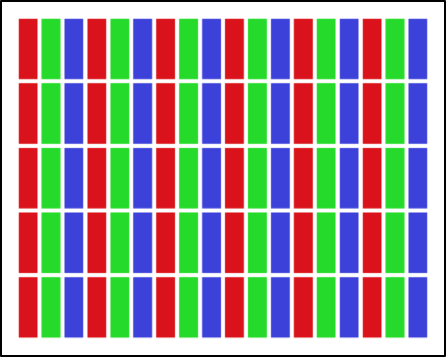
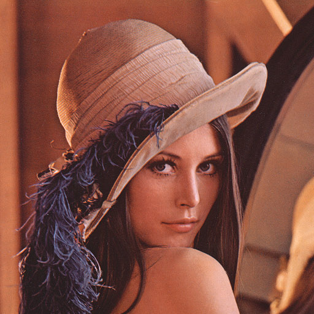
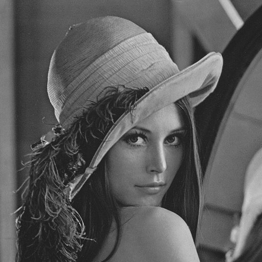
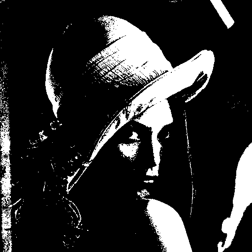
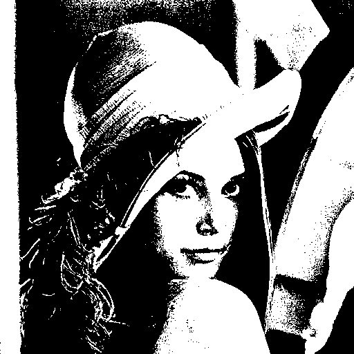
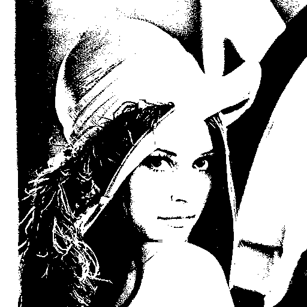

# Trabalho Nº 3

## Programando *assembly* para o processador ARM

## 1. Instruções Gerais

- Grupos definidos no AVA;
- Ler o documento sobre Normas para entrega dos Relatórios;
	- Opcionalmente, o relatório pode ser escrito no `README.md`;
- Ler atentamente todo o enunciado deste trabalho antes de realizá-lo;
- Consultar as referências adicionais e manuais sempre que necessário;
- A entrega será no repositório gerado para o grupo no Classroom 50.

## 2. Objetivos da Prática

- Conhecer o processador ARM e seu conjunto de instruções;
- Familiarizar-se com a programação *assembly* para resolver problemas simples;
- Realizar mudanças simples no processador (opcional);
- Descrever as atividades gerais desenvolvidas no trabalho em um relatório.

## 3. Materiais e Equipamentos

- Simulador [VisUAL](https://salmanarif.bitbucket.io/visual/user_guide/index.html); ou
- Simulador [VisUAL2](https://tomcl.github.io/visual2.github.io/guide.html);
- Documentação: Arm Armv8-A A32/T32 Instruction Set Architecture;
- Unidade Lógica e Aritmética (ULA);
- Processador ARM em Verilog (incompleto).

> Nem todas as instruções são suportadas pelos simuladores.

## 4. Fundamentos teóricos

### 4.1. Manipulação de Imagens por Computador

A manipulação ou processamento de imagens por computador é uma área muito ampla, com diversas aplicações. Nesta seção veremos alguns aspectos básicos e exemplos de operações para que se possa usar problemas simples desta área no aprendizado da linguagem *assembly* do processador ARM.

Os monitores representam as cores usando o modelo de cores RGB, que é um modelo de cores aditivo em que as luzes vermelha (R), verde (G) e azul (B) são adicionadas para reproduzir uma ampla gama de cores. Suponha que tenhamos um byte para cada canal de cor. Assim, será possível representar $2^{3 \times 8} = 16.777.216$ cores diferentes, com sequências de 3 bytes para cada pixel.



Figura 1: Modelo de cores RGB [^1].

Alguns exemplos de cores são: branco (`0xFFFFFF`), vermelho (`0xFF0000`), verde (`0x00FF00`), azul (`0x0000FF`), amarelo (`0xFFFF00`), magenta (`0xFF00FF`), ciano (`0x00FFFF`) e preto (`0x000000`).

Arquivos de imagens podem possuir formatos bastante complexos, especialmente aqueles que compactam os dados da imagem para reduzir o tamanho do arquivo. Aqui vamos usar o formato bitmap (BMP), que é um dos mais simples e não possui compactação. No cabeçalho, nas imagens usadas aqui, estão 54 bytes com informações diversas, entre elas a largura e a altura da imagem [^2].

Aqui vamos usar uma foto muito conhecida da área de processamento de imagens. Vamos transformar a imagem original colorida em tons de cinza. Para isso, vamos igualar os canais de cor [^3].


(a) Imagem original


(b) Imagem processada

Figura 2: Exemplo de processamento de imagem.

Para obter a imagem em tons de cinza, temos que percorrer cada pixel com o seguinte cálculo:

```c
for (i = 0; i < size; i++) {
	b = buffer[i][2]; // blue
	g = buffer[i][1]; // green
	r = buffer[i][0]; // red
	gray = (r + (g << 1) + b) >> 2;
	out[i][2] = (unsigned char)gray;
	out[i][1] = (unsigned char)gray;
	out[i][0] = (unsigned char)gray;
}
```

Se quisermos obter uma imagem monocromática, podemos realizar o mesmo processo, estabelecendo um limiar (*threshold*) e colocando branco (`255`) para todos os pixels acima dele e preto (`0`) para todos os pixels abaixo dele. Encontrar um limiar adequado pode ser complexo. Para esta imagem, escolher o valor médio (`127`) não gera necessariamente o melhor resultado.


(a) threshold = 127


(b) threshold = 95


(c) threshold = 79

Figura 3: Imagens em preto e branco com diferentes limiares.

Para auxiliar na escolha do limiar, podemos construir um histograma da imagem. Usando a imagem em escala de cinza, percorremos todos os seus pixels e contamos, agrupando pela intensidade. Os histogramas mostram que os limiares que dividem os pixels mais ou menos ao meio geram melhores resultados e não estão necessariamente no meio da escala.


(a) threshold = 127


(b) threshold = 95


(c) threshold = 79

Figura 4: Histogramas com diferentes limiares em destaque.

Agora que já temos alguns exemplos de processamento de imagens possíveis, vamos implementá-los em *assembly* do ARM, mas primeiro vamos fazer um pequeno ajuste para simplificar. Vamos usar o modelo de cores ARGB. Neste modelo, o canal A é usado para representar transparência, mas nós vamos ignorá-lo. Vamos usar seu formato apenas para ter um pixel em cada palavra da memória (32 bits), facilitando o endereçamento por palavras.


Figura 5: Modelo de cores ARGB.

## 4.2. Compilação com GCC e execução com QEMU

Além dos simuladores VisUAL e VisUAL2, é possível testar uma função ARM em conjunto com um programa C usando compilação cruzada com GCC e execução no QEMU. O exemplo disponível em [`labs/arm`](https://github.com/menotti/mm/tree/main/labs/arm) converte uma imagem RGB para tons de cinza usando a função `convert_grayscale`, implementada em `convert_grayscale.arm.s`.

A função possui a seguinte interface em C:

```c
void convert_grayscale(int width, int height, uint8_t *pixels);
```

O vetor `pixels` contém `width * height * 3` bytes RGB intercalados. A conversão é feita no próprio vetor: para cada pixel, os três componentes são substituídos por:

```text
cinza = (vermelho + 2 * verde + azul) >> 2
```

### Dependências

Em um ambiente Debian/Ubuntu, instale o compilador cruzado ARM e o emulador QEMU:

```sh
sudo apt install gcc-arm-linux-gnueabihf qemu-user
```

### Compilar e executar

Acesse o diretório do laboratório e compile o programa:

```sh
cd labs/arm
make
```

O programa recebe a largura e a altura na linha de comando e lê os bytes RGB, em decimal, pela entrada padrão. Ele imprime um byte de cinza por pixel:

```sh
printf '255 0 0 0 255 0 0 0 255 255 255 255\n' | \
	qemu-arm ./convert_grayscale 2 2
```

Saída esperada:

```text
63 127 63 255
```

O teste automatizado compila o programa e executa o mesmo caso:

```sh
make test
```

Para executar o caso de demonstração definido no `Makefile`:

```sh
make run
```

Para remover o executável e os arquivos objeto gerados:

```sh
make clean
```

Também é possível escolher outro compilador cruzado ou outro executável QEMU:

```sh
make CROSS=arm-linux-gnueabihf QEMU=qemu-arm
```

## 5. Procedimentos

Para realização deste trabalho, o grupo deverá implementar obrigatoriamente no mínimo **5 programas em assembly do ARM para processamento de imagens**. As duas primeiras implementações serão efetuadas por todos os grupos; as outras podem ser escolhidas livremente a partir do número 3 da lista a seguir:

1. **(obrigatório)** Implementar um programa para converter uma imagem colorida para tons de cinza;
2. **(obrigatório)** Implementar um programa para converter uma imagem para preto e branco;
3. Implementar um programa para gerar o histograma de uma imagem;
4. Implementar um dos programas obrigatórios usando o modelo RGB (24 bits), ou seja, com dados desalinhados na memória;
5. Implementar um dos programas obrigatórios com operações de ponto flutuante usando a equação $gray = 0,299 \times R + 0,587 \times G + 0,114 \times B$;
6. Implementar um programa para borrar uma imagem (*blur*);
7. Simular qualquer um desses programas no Processador ARM em Verilog (incompleto). Será preciso completar as instruções faltantes;
8. Implementar um programa para espelhar horizontalmente e/ou verticalmente uma imagem, tratando corretamente a ordem dos pixels e o cabeçalho BMP;
9. Implementar um detector de bordas simples, como Sobel ou diferença entre pixels vizinhos, usando apenas operações inteiras e comparar o resultado com uma imagem de referência;
10. Implementar um ajuste de brilho ou contraste em *assembly*, saturando os valores no intervalo `[0, 255]` e avaliando o efeito em imagens claras e escuras.

## Referências Bibliográficas

[^1]: [Image manipulation in Python](https://www.codementor.io/@isaib.cicourel/image-manipulation-in-python-du1089j1u)
[^2]: [Blur RGB Image using C](https://abhijitnathwani.github.io/blog/2018/01/09/Blur-RGB-Image-using-C)
[^3]: [convert_grayscale](https://github.com/menotti/convert_grayscale)


